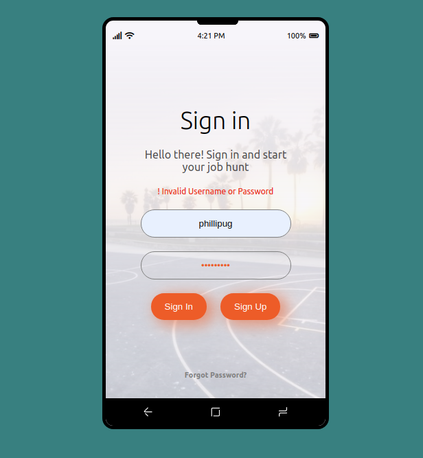
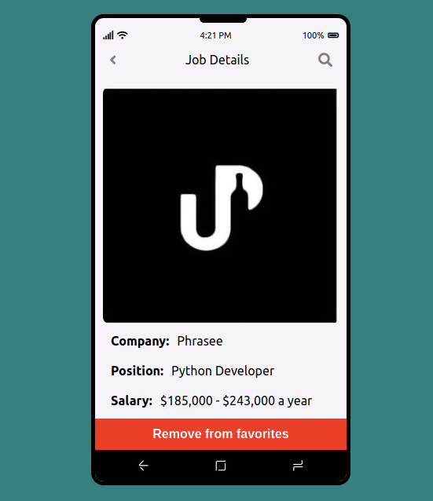
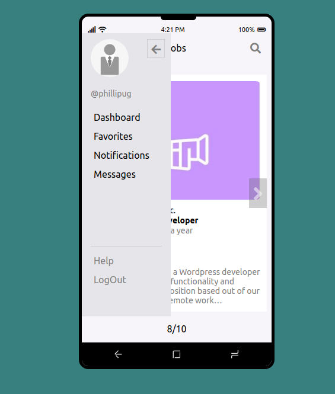
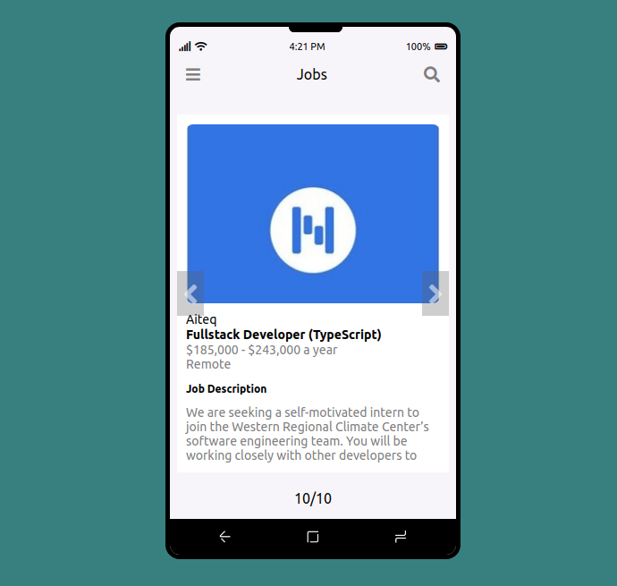

# Microverse Jobs

A mobile web app for finding jobs online. Its specifically tailored to software development jobs best suited for bootcamp students with little to no previous tech-related working experience.

  <a>
    
  

  </a>

  <h2 align="center">Microverse Jobs</h2>
  <h3 align="center">Built with React (Using React Hooks)</h3>

  

   <a href="https://microverse-jobs-mobile.netlify.app/">View Live Demo</a>
   .
    <a href="https://github.com/phillipug/microverse-jobs/issues">Report Bug</a>
    · 
    <a href="https://github.com/phillipug/microverse-jobs/issues">Request Feature</a>
  

## About this project
This is a mobile web app for finding jobs online built with React (Using React Hooks to manage state).

This Application is built as a front end app consuming a Ruby on Rails API ([Microverse Jobs API](https://github.com/PhillipUg/microverse-jobs-api)) separately deployed to Heroku. 

### End Points
This application consumes a couple of endpoints served by an api accessible online at https://microverse-jobs-api.herokuapp.com/ as the base Url;

#### POST
- /api/v1/users - (create a user - signup)
- /api/v1/login - (create a session - signin)

#### GET
- /api/v1/jobs - (fetch all jobs)
- /api/v1/jobs/:id - (fetch a specific job)
- /api/v1/user-jobs - (fetch all jobs favorited by logged in user)

#### PUT
- /api/v1/favorites/:id - (update favorited status when user adds/removes job to/from favorites)

I use Axios to fetch jobs, user and favorites data and then use React Hooks to manage the data in various components.

### Usage
- A user can create an account(signup)
- A user can signin(login) and logout
- A user can peruse through jobs by clicking either the left or right navigation arrows
- A user can click on any of the jobs to see more details
- On the details page, a user can click the button to either add or remove that particular jon from/to favorites
- A user can see their favorited jobs

## Screenshots

 
 

## Built With

- ReactJs
- React Hooks
- Rails API 
- Axios
- Netlify (For Front-end)
- Heroku (For Back-end)
- CSS (Modules)
- HTML
- Webpack
- ES6 JavaScript.

## Live Demo

[Live Demo Link](https://microverse-jobs.netlify.app/)

## Installation

To get a local copy up and running follow these simple example steps.

### Prerequisites

Have a browser installed

### Setup

Clone [this repo](https://git@github.com/phillipug/microverse-jobs.git)

### Usage - Follow these

1. <code>cd</code> into the project directory
2. run <code>npm install</code>
2. run <code>npm start</code>
3. Navigate to [localhost:3000](http://localhost:3000) in your browser.
4. Enjoy :smiley:

## Future Updates
- fetch data from multiple apis
- enable search to enable filtering by location, job title etc..
- add notifications and messages features
etc..

:bust_in_silhouette: **Contacts**

- LinkedIn: [Phillip Musiime](https://www.linkedin.com/in/phillip-musiime/)
- GitHub: [PhillipUg](https://github.com/PhillipUg)
- Twitter: [@Phillip_Ug](https://twitter.com/Phillip_Ug)
- E-mail: phillipmusiime@gmail.com

## 🤝 Contributing

Contributions, issues, and feature requests are welcome!

Feel free to check the [issues page](https://github.com/phillipug/microverse-jobs/issues).

## Show your support

Give a ⭐️ if you like this project!

## 📝 License

This project is [MIT](lic.url) licensed.
